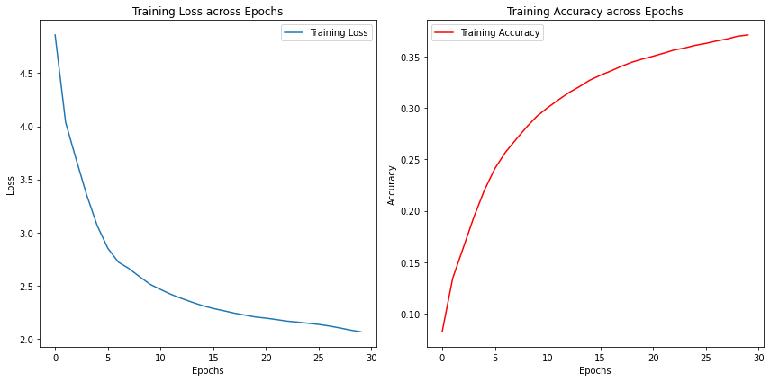
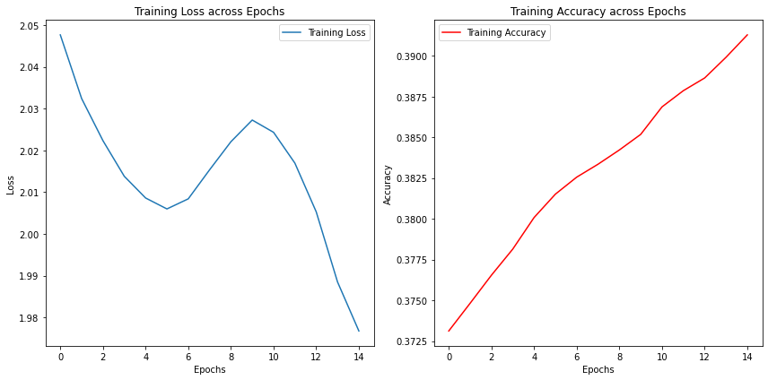

# EN-AR Translator

The EN-AR Translator leverages the Transformer architecture to provide English to Arabic translations. The project is built upon Django and makes efficient use of Tensorflow and Numpy for its operations.

## Requirements

For this project to function correctly, ensure the following are installed:

- Django
- Tensorflow
- Numpy

## Installation & Setup

1. **Clone the repository:**
    ```bash
    git clone https://github.com/ALLIA12/EN-AR-Translator.git
    ```

2. **Navigate to the project directory:**
    ```bash
    cd EN-AR-Translator
    ```

3. **Clean the data:**

    Before training, the dataset needs cleaning. Run the `cleanData` notebook to preprocess the dataset:

    ```bash
    jupyter notebook cleanData.ipynb
    ```
    > Note: The dataset file needs to be named CCMatrix v1- EN to AR Dataset.tmx

4. **Training the model:**

    Once the data is clean, use the `EN-AR` notebook to train the model:

    ```bash
    jupyter notebook En-AR.ipynb
    ```
    > Note: if you change the model size or parmeters, make sure to update the application.py file accordingly

## Usage

After training the model:

1. Navigate to the project's root directory.

2. Start the Django server:

    ```bash
    python manage.py runserver
    ```

3. Access the application via your preferred web browser at:

    ```
    http://127.0.0.1:8000/
    ```

## Model Overview

The heart of this translator is the Transformer architecture, known for its efficiency in handling sequence-based tasks. [1]


## Training Details

The model underwent training in two phases using the CCMatrix dataset for English to Arabic translation [2]:

### Phase 1: Epochs 1-30

Training accuracy and loss metrics for the first 30 epochs:



### Phase 2: Epochs 31-45

For fine-tuning, the model was trained for an additional 15 epochs. The accuracy and loss during this phase:




## Refernces

[1](https://proceedings.neurips.cc/paper_files/paper/2017/file/3f5ee243547dee91fbd053c1c4a845aa-Paper.pdf)

[2](https://opus.nlpl.eu/CCMatrix.php)
